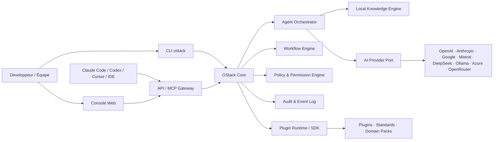
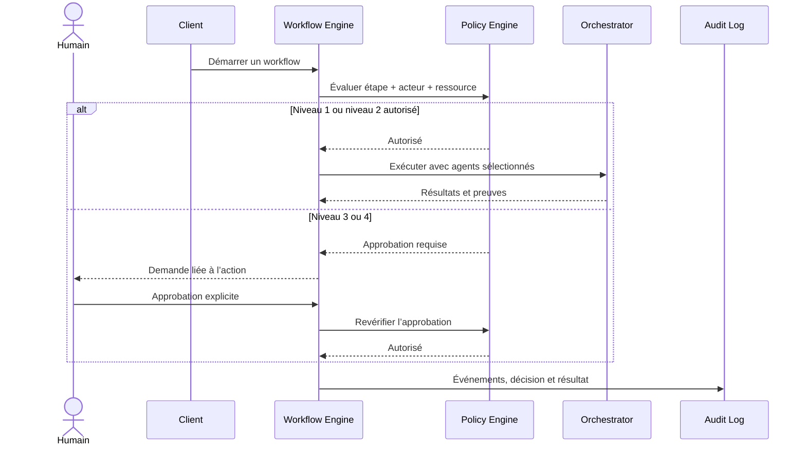

# Architecture OStack

## Principes directeurs

1. **Headless-first** — le noyau ne dépend ni de la CLI, ni du Web, ni d’un fournisseur IA.
2. **Ports et adaptateurs** — modèles, stockage, outils et interfaces sont remplaçables derrière des contrats stables.
3. **Sécurité par défaut** — refus par défaut, moindre privilège et approbation humaine obligatoire en production.
4. **Traçabilité** — chaque décision, appel d’outil, approbation et artefact porte un identifiant de corrélation.
5. **Configuration déclarative** — agents, workflows, politiques et packs métier sont versionnés et validés par schéma.
6. **Local-first** — la connaissance et l’audit fonctionnent localement ; les services externes sont optionnels.

## Vue conteneurs

## Flux d’exécution sécurisé

## Frontières et décisions

| Décision | Choix | Justification |
|---|---|---|
| Runtime initial | Node.js 22 + TypeScript | Même langage pour CLI, API, SDK et Web ; distribution multiplateforme simple. |
| Couplage IA | Interface `ModelProvider` | Le fournisseur et le modèle peuvent changer sans modifier agents ni workflows. |
| Workflows | DAG déclaratif versionné | Reproductibilité, validation statique et reprise future. |
| Audit MVP | JSON Lines append-only local | Lisible, diffusable et exploitable sans service ; une base immuable sera un adaptateur production. |
| RAG MVP | Index lexical local | Démarrage sans service ni fuite de code ; embeddings et base vectorielle viendront via plugins. |
| API MVP | HTTP natif, lecture seule | Surface d’attaque et dépendances minimales pour le premier incrément. |
| Plugins | Manifestes + permissions | Capabilités visibles et contrôlables avant activation. |
| Mutations locales | Sessions sandboxées et réversibles | Aucun agent ne reçoit un accès arbitraire au système de fichiers ; chaque diff peut être inspecté puis annulé. |
| Validation des changements | Copie éphémère avant promotion | Les builds et tests n’affectent pas le projet réel ; une dérive concurrente bloque la promotion. |

## Cible production

Le stockage local est volontairement le mode développeur. Une installation d’équipe utilisera PostgreSQL pour l’état, un journal d’audit immuable, un gestionnaire de secrets externe, OpenTelemetry, une file durable pour les jobs et un stockage objet pour les artefacts. Aucun adaptateur production ne contournera le moteur de politiques.
