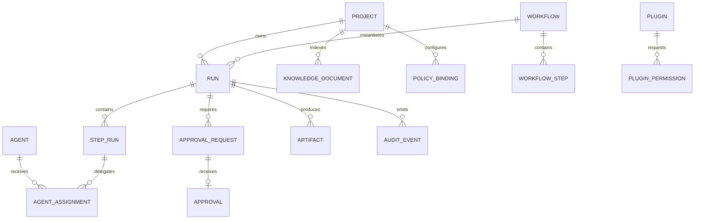

# Modèle de données

Tous les identifiants sont opaques. Les événements d’audit sont append-only. Une approbation référence exactement une demande, son empreinte de paramètres et une expiration ; elle n’est jamais une permission générale.
